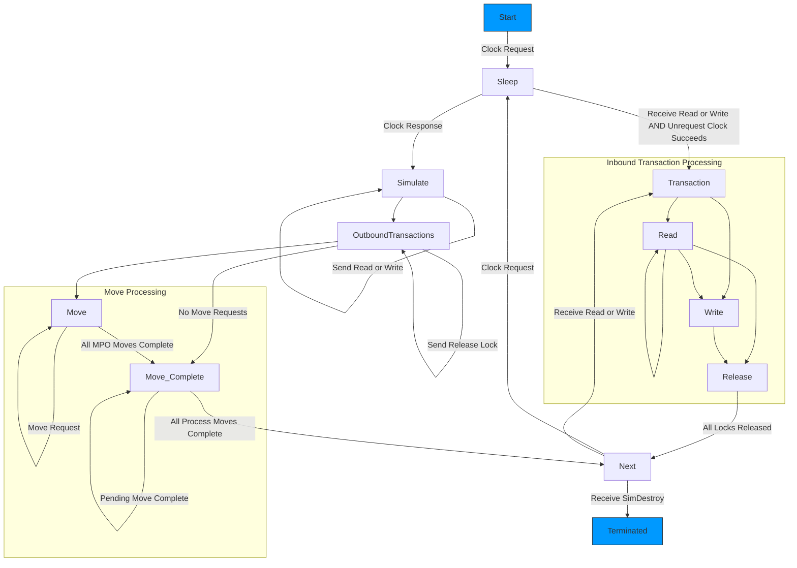

```mermaid

graph TD;

    Start-->| Clock Request |Sleep
    Next-->| Receive SimDestroy |Terminated
    Next-->| Clock Request |Sleep
    Next-->| Receive Read or Write |Transaction

    Sleep-->| Receive Read or Write AND Unrequest Clock Succeeds |Transaction
    Sleep-->| Clock Response |Simulate
    Simulate-->| Send Read or Write | Simulate
    Simulate-->OutboundTransactions
    OutboundTransactions-->| Send Release Lock|OutboundTransactions
    OutboundTransactions-->Move
    OutboundTransactions-->| No Move Requests | Move_Complete
    Move-->| Move Request |Move
    Move-->| All MPO Moves Complete | Move_Complete
    Move_Complete-->| Pending Move Complete | Move_Complete
    Move_Complete-->| All Process Moves Complete | Next 

    Transaction-->Read;
    Transaction-->Write;
    Read-->Read
    Read-->Write
    Read-->Release
    Write-->Release
    Release-->| All Locks Released | Next

    style Terminated fill:#09f,stroke:#333,stroke-width:px
    style Start fill:#09f,stroke:#333,stroke-width:px


subgraph Inbound Transaction Processing
    Transaction
    Read
    Write
    Release
end

subgraph Move Processing
    Move
    Move_Complete
end
```
