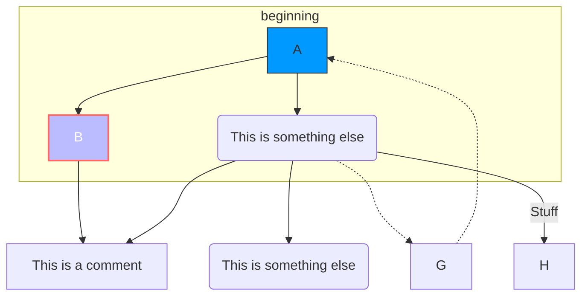

```mermaid

graph TD;
    A-->B;
    A-->C;
    style A fill:#09f,stroke:#333,stroke-width:px
    style B fill:#bbf,stroke:#f66,stroke-width:2px,color:#fff,stroke-
    B-->D;
    C-->D[ This is a comment ];
    C( This is something else)-->F( This is something else);
    C-.->G;
    C-->| Stuff |H;
    G-.->A;

subgraph beginning
A & B & C
end

```
